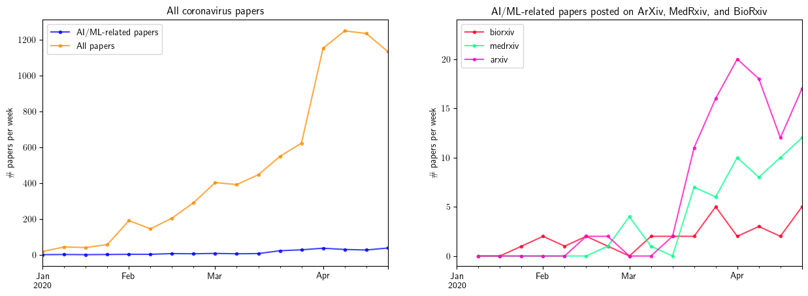

# COVID-19 Literature Search
Methodology for automated COVID-19 literature search to identify AI-related articles.

## The CORD-19 dataset

We retrieve articles from the CORD-19 open research dataset, available at: 

> COVID-19 Open Research Dataset (CORD-19). 2020. Version 2020-05-01. Retrieved from https://pages.semanticscholar.org/coronavirus-research. Accessed 2020-05-01. doi:10.5281/zenodo.3715505

The query used by to retrieve results is as follows:

    "COVID-19"[All Fields] OR ("coronavirus"[MeSH Terms] OR "coronavirus"[All Fields]) OR 
    "Corona virus"[All Fields] OR "2019-nCoV"[All Fields] OR "SARS-CoV"[All Fields] OR 
    "MERS-CoV"[All Fields] OR "Severe Acute Respiratory Syndrome"[All Fields] OR 
    "Middle East Respiratory Syndrome"[All Fields]
    
The latest metadataset can be accessed [here](https://ai2-semanticscholar-cord-19.s3-us-west-2.amazonaws.com/latest/metadata.csv). The preprint describing the dataset is available [here](https://www.semanticscholar.org/paper/CORD-19%3A-The-Covid-19-Open-Research-Dataset-Wang-Lo/bc411487f305e451d7485e53202ec241fcc97d3b).

## Filtering and results

We kept only articles containing either a title and an abstract, and only articles with a publication year of 2019 or 2020. For the time period between 1st January 2020 and 24th April 2020, the search retrieved 8,747 COVID-related articles and 216 AI-related articles. We estimate that 11 of the 216 are duplicates based on repetition of the title or author names.

